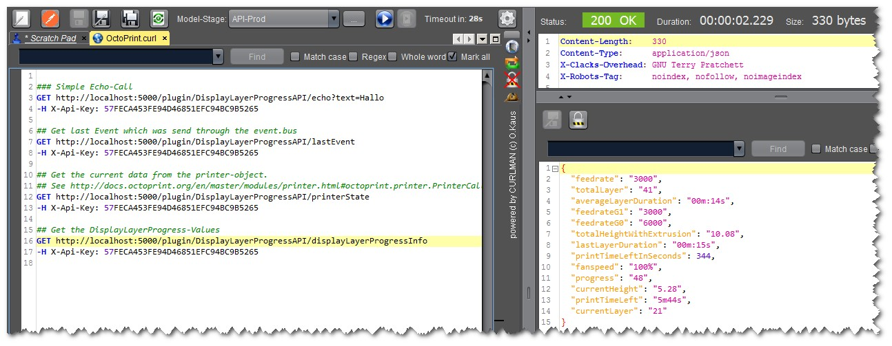

# DisplayLayerProgress-API

An __additional__ OctoPrint-Plugin for [DisplayLayerProgress-Plugin](https://github.com/OllisGit/OctoPrint-DisplayLayerProgress).

It provides REST-APIs for reading the DisplayLayerProgress - Payload which is send through the event-bus. [More details](https://github.com/OllisGit/OctoPrint-DisplayLayerProgress#developer---section)

It also provides some other "basic" informations like the lastEvent which was send to the event-bus and the current printer data.

## Usage
After installations you can call each listed endpoint with your api-key:

| Endpoint                             | Response |
| ------------------------------------ |---|
| __yourOctoPrintURL__/plugin/DisplayLayerProgressAPI/echo?text=Hallo | Simple echo function which returns the value you send via text-parameter|
| __yourOctoPrintURL__/plugin/DisplayLayerProgressAPI/lastEvent | Name of the last command send to the event-bus|
| __yourOctoPrintURL__/plugin/DisplayLayerProgressAPI/printerState | Printer current data. [Structure description](http://docs.octoprint.org/en/master/modules/printer.html#octoprint.printer.PrinterCallback.on_printer_send_current_data)|
| __yourOctoPrintURL__/plugin/DisplayLayerProgressAPI/displayLayerProgressInfo | DisplayLayerProgress-Values. [Structure description](https://github.com/OllisGit/OctoPrint-DisplayLayerProgress#developer---section)|

Sample:         
        
        curl -H "X-Api-Key:57FECA453FE94D46851EFC94BC9B5265" http://localhost:5000/plugin/DisplayLayerProgressAPI/lastEvent

## Setup

TODO not published to offical OctoPrint Plugin-Repository .... Install via the bundled [Plugin Manager](https://github.com/foosel/OctoPrint/wiki/Plugin:-Plugin-Manager)
or manually using this URL:

    https://github.com/OllisGit/OctoPrint-DisplayLayerProgressAPI/releases/latest/download/master.zip

## Configuration

See Plugin-Settings

## Versions
see [Release-Overview](https://github.com/OllisGit/OctoPrint-DisplayLayerProgress/releases/)
